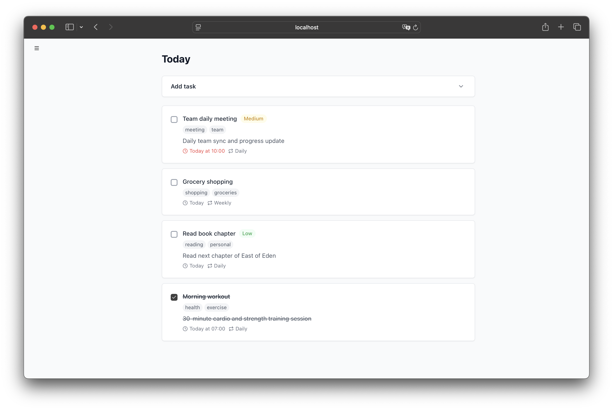
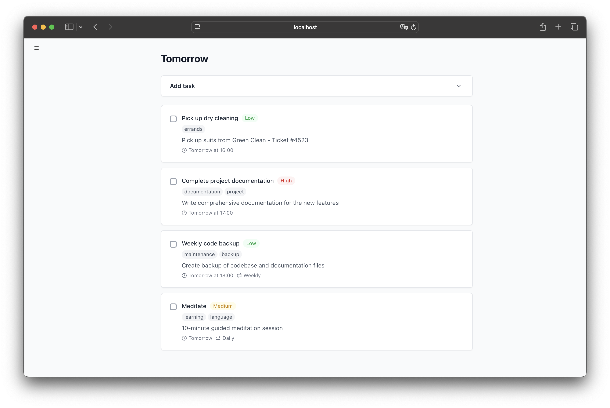
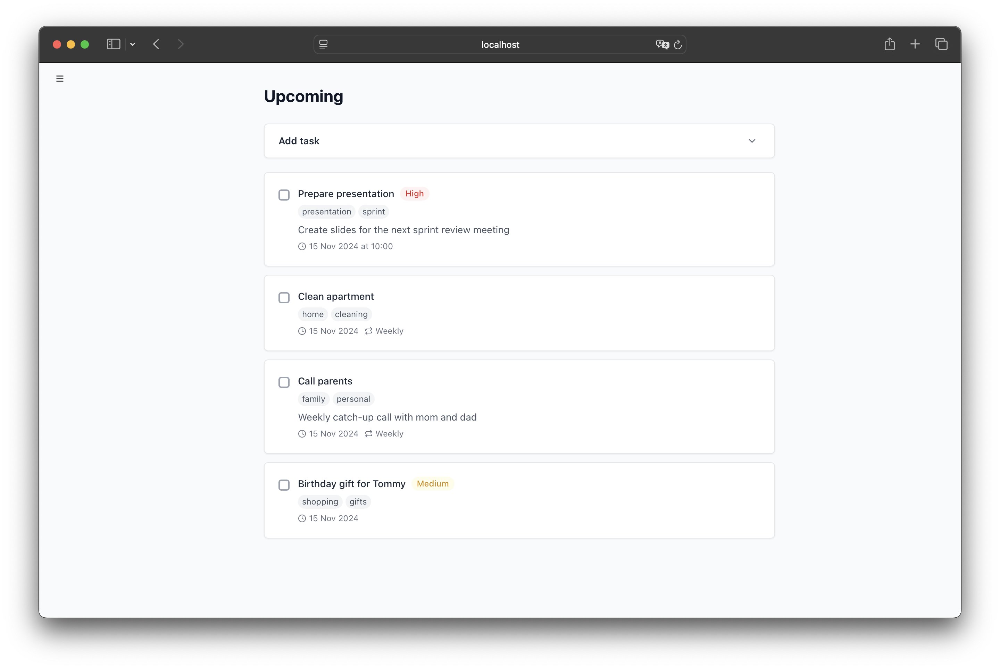
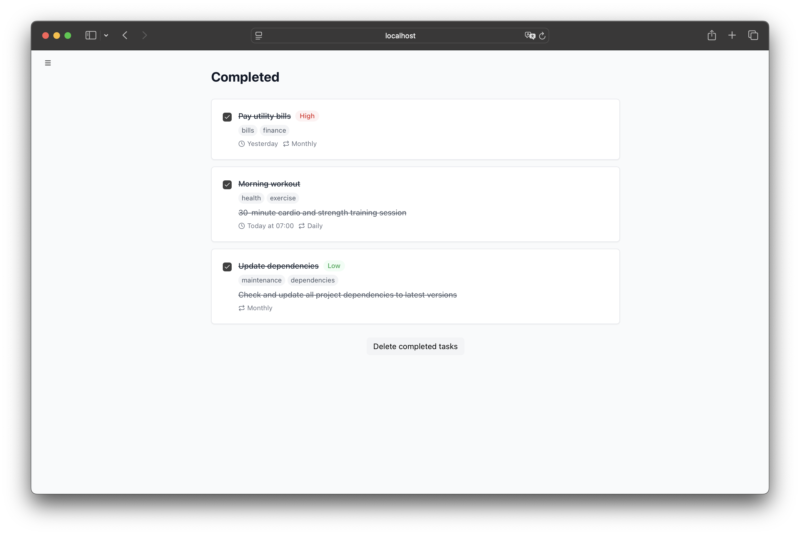
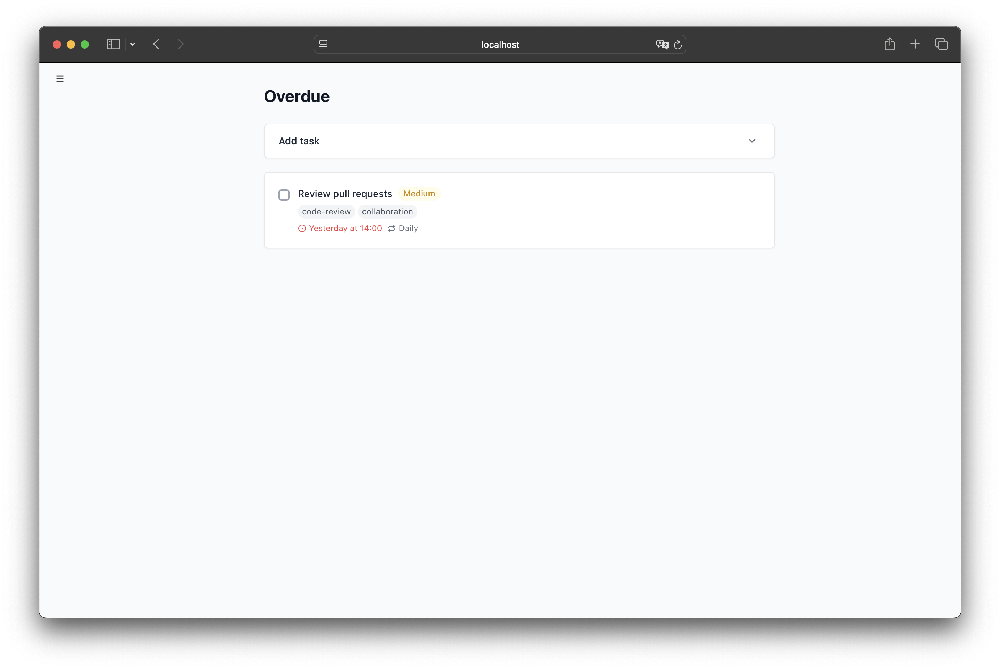
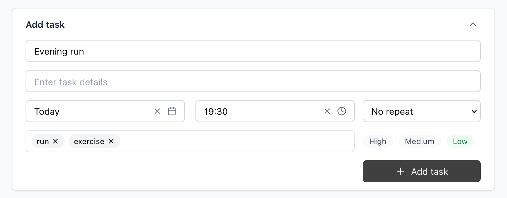
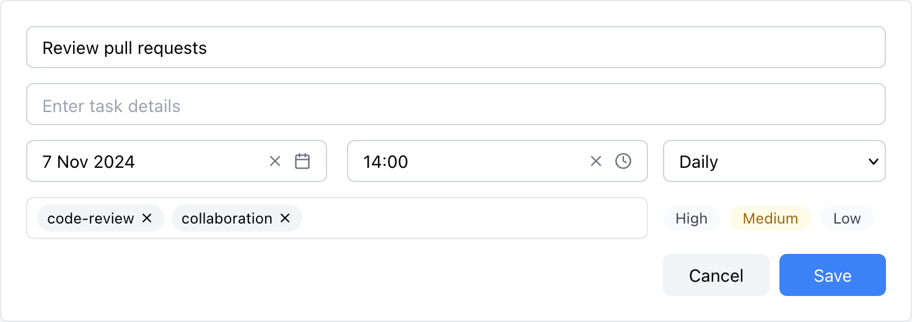
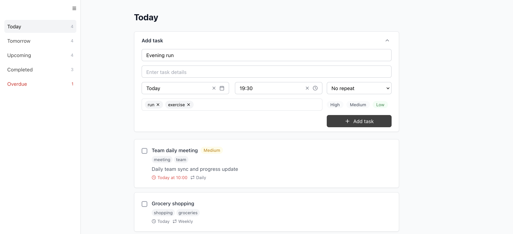

# To-Do App (frontend)

A modern, feature-rich task management application built with React. Organize your daily tasks, set priorities, track due dates, and manage recurring responsibilities with an intuitive user interface. For now it is frontend only.

https://github.com/user-attachments/assets/c54a4734-ec4c-48a4-83be-f953482afcfd

## Features

### Task Management

- Create, edit, and delete tasks
- Add detailed descriptions
- Set due dates and times
- Organize with tags
- Set task priorities
- Configure task recurrence
- Track task completion status

### Views

#### Today's tasks



#### Tomorrow's tasks



#### Upcoming tasks



#### Completed tasks



#### Overdue tasks



### Useful Features

- Automatic task status updates
- Intelligent due date handling
- Recurring task management
- Task count indicators
- Collapsible sidebar navigation

### UI/UX

- Clean, modern interface
- Responsive design
- Hover-activated sidebar
- Confirmation dialogs for important actions
- Dynamic form handling
- Rich task metadata display

## Technology Stack

- React
- Tailwind CSS for styling
- Lucide React for icons
- React Router for navigation
- date-fns for date manipulation

## Installation

1. Clone the repository:

```bash
git clone https://github.com/hackerman70000/To-Do-App.git
```

2. Install dependencies:

```bash
cd To-Do-App
npm install
```

3. Start the development server:

```bash
npm start
```

## Usage

### Creating a Task



1. Click "Add task" in the main view
2. Fill in the task details:
   - Title\*
   - Description
   - Due date and time
   - Priority level
   - Tags
   - Recurrence pattern

\*Required field

### Managing Tasks



- Mark tasks as complete by clicking the checkbox
- Edit tasks by clicking the edit icon
- Delete tasks using the delete icon
- Filter tasks using the sidebar navigation

### Task Filtering



- Use the sidebar to switch between different views:
  - Today: Shows tasks due today
  - Tomorrow: Shows tasks due tomorrow
  - Upcoming: Shows future tasks
  - Completed: Shows finished tasks
  - Overdue: Shows past-due tasks

### Recurring Tasks

1. Create a task with a due date
2. Select a recurrence pattern:
   - Daily
   - Weekly
   - Monthly
3. When marked as complete, a new instance will be automatically created

## Component Details

### Core Components

- `TaskForm`: Handles task creation and editing
- `TaskItem`: Renders individual task items with all metadata
- `TaskList`: Manages the task collection display
- `Sidebar`: Provides navigation and filtering options

### Form Components

- `DateTimePicker`: Custom date and time selection
- `PrioritySelect`: Priority level selection
- `RecurrenceSelect`: Recurrence pattern selection
- `TagInput`: Tag management input
- `TaskFormFields`: Combined form fields for task creation/editing

## Local Storage

Important note: This is a frontend-only application for now. In the future, it will use a database to store tasks. The application uses local storage to persist tasks between sessions.

## License

This project is licensed under the MIT License - see the LICENSE file for details.
